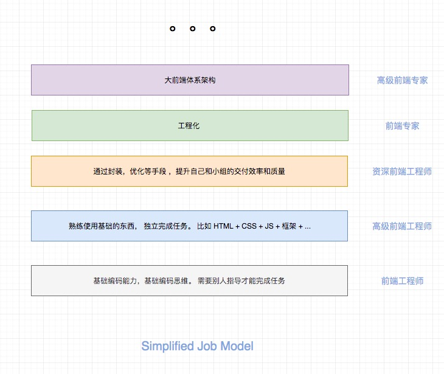
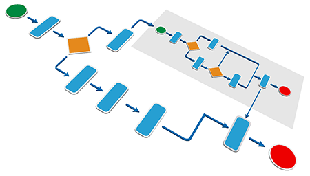
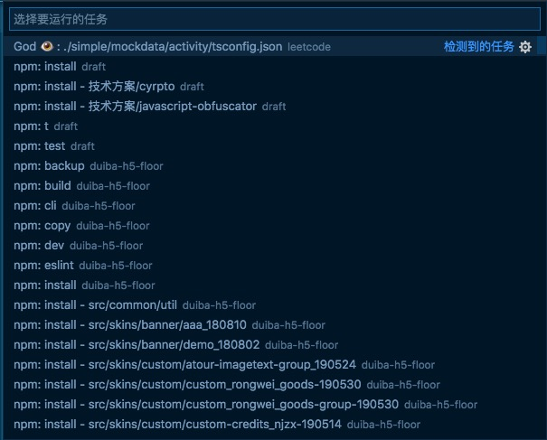
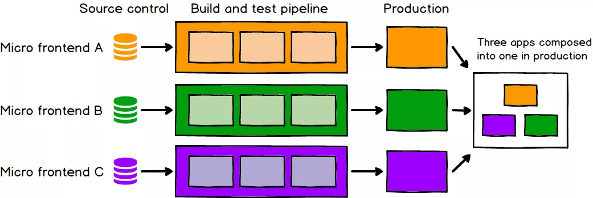

# 大前端面试宝典 - 图解前端

这是一份自己总结的关于准备前端面试的一个复习汇总项目，项目不定时更新。

这不仅仅是一份用于求职面试的攻略，也是一份前端 er 用来检视自己，实现突破的宝典。
希望通过这个指南，大家可以打通自己的任督二脉，在前端的路上更进一步。

本仓库大量采用图的形式来传达知识，所谓一图胜千言，希望通过这种图文并茂的表达方式
让你更容易记住一些抽象，难以理解的概念，《图解前端》是我给它的副标题。

所有的内容按照主题进行分类，大家可以根据自己需要随意传送，enjoy🍻🍻🍻

我的目标是做`宇宙最强的前端面试指南`。

> WIP： 🚧 项目还在施工中哦，请戴好头盔！⚠️

## 简介

面试是一件很主观很难的事情。 面试不通过不代表你就不合格，同样地即使面试通过也不意味着你就合格了。
作为候选人，通常会给你 45 分钟的时间来让你展示自己的技能。
作为一名面试官，同样难以在这么短的时间里评估这个人是否适合这项工作。
对于面试来说，没有任何一种标准能够适合所有人，面试官通常会覆盖某一个领域，但除此之外，他们会自行决定应该问哪些问题。

准备面试，我们应该准备一些真正能够体现面试人水平的题目，比如一些编程题，设计题，框架选型等，不要过分
拘泥于特别小的问题，尤其是 API 的问题，比如`==`的隐式转化，我个人很反感这种问题。
相反面试官应该更关注`面试者是否了解前端开发的基本原理，而不是依赖更高级别的抽象。`
比如你是否可以在不依赖库的情况下完成开发任务（当然实际情况很少这样），这样你才能彻底理解库在背后都做了什么。

## 关于我

我是一个对技术充满兴趣的程序员，擅长前端工程化，前端性能优化，前端标准化等。

做过。net， 搞过 Java，现在是一名前端工程师。拥有两年前端面试官的经验，
对于面试的一些技术问题和套路有一定的认识和积累。

除了我的本职工作外，我会在开源社区进行一些输出和分享，比较受欢迎的有 [leetcode 题解](https://github.com/azl397985856/leetcode)
和 [我的第一本小书](https://github.com/azl397985856/automate-everything)

如果大家需要内推的可以找我，我这里有包括阿里，腾讯，头条，网易等很多公司的朋友。
有需要可以直接群里联系我，或者发送到我的个人邮箱 [azl397985856@gmail.com]。

## 每日一题

[每日一题汇总](./daily/)

## 模拟面试记录

每期模拟面试都有一个参赛名额，不限制观众人数。观众不需要报名，面试开始后我会在群里发链接，大家点进来即可参加。形式是`B 站直播+VSCode 协同`。

要求：

1. 参赛人员需要安装 vscode 和对应插件 live share，并且要可以语音。

2. 参加面试的人需要提供你想面试的岗位级别和具体信息。 比如 web 前端 p5, nodejs 工程师 p6

如果需要更为专业的模拟面试，可以免费报名参加《大前端模拟面试》，面试前会花半个小时左右提前了解候选人信息，做更切合你的面试。面试过程花大概半个小时进行面试，半个小时对面试的过程进行总结，并给出改进意见。包括但不限于简历， 基础技能，沟通能力，潜力等纬度分析。 杭州的小伙伴也可以选择现场面试 (onsite)。整个过程采取公开的形式，即有观众参与，如果介意可以私聊我为你一对一

- [大前端模拟面试 - 2019-12-14](./mock-interview/2019-12-14.md)
- [大前端模拟面试 - 2019-12-14](./mock-interview/2020-2-20.md)

## 主题

### 面试流程

首先第一个主题是面试的流程， 面试流程从时间先后的顺序可以划分为：
`网投/内推`，`线上评估`, `电话面试/视频面试`, `现场面试`。这四个流程在一次面试中不一定都会有。

- 网投/内推

网投指的是在网络上投递简历，这样选择面会很大。
内推指的是找内部人员推荐， 内推不仅有着快速地反馈流程，而且在有时候岗位刚刚空缺出来，岗位还没有 JD 的时候就可以内推。
因此建议大家尽量内推。

- 线上评估

线上评估指的是在线做题，很多大公司以及外企都会设置这部分，尤其是对于应届生而言。
这部分考察候选人的`基本算法能力，解题思路`

- 电话面试/视频面试

这部分主要考察候选人的`算法能力，做题速度，沟通交流技巧`。

- 现场面试

这部分主要考察候选人的`白板算法，系统设计，应变能力，价值观`等。

### 面试的考察点

上面介绍了面试的基本流程以及考察方向，接下来我们总结一下我们通常挂的原因有哪些？为此我们需要注意什么？有没有什么小技巧？我在这里进行了比较详细的 [总结](./topics/surface/aspects.md)

另外这里有一份资深 HR 写的 [面试应答有哪些话术和技巧？](https://www.zhihu.com/question/35953016) 内容非常不错，希望可以帮助到你。

### Job Model

在面试之前大家应该都对自己有了一个定位，自己要面试的层级是什么样的，
需要什么的技能，有什么要求。

Job Model 是 一个很重要的参考标准。 当然每个公司的 Job Model 都会不太一样，
大家可以根据自己心仪的公司的 Job Model 作为参考，自检一下。

比如我想要面试的是 P7 的岗位，那么 P7 的 Job Model 是什么呢？我可能需要提前了解一下。
一般来说 P7 的岗位要求会有：

1. 基础扎实。计算机网络/设计模式/正则/安全等，并且要深入了解各项技术的原理和设计，而不只是使用。
2. 经验丰富。熟悉业内不同技术方案以及优缺点，并且能选择最切合当前业务的方案。
3. 技术驱动。探索新技术，将新技术带入团队，并赋能业务。
4. 软技能。协同能力强，带领团队或者跨团队完成目标的能力。
   ...

大家可以根据自己的期望层级，以及心仪公司的 Job Model 进行自测。

我在这里画了一个简化版本的 Job Modal，大家可以根据自己的实际情况找自己的目标，
不同层级需要掌握的深度和广度是不一样的，大家根据自己的实际情况学习。

后续我计划会出一份详细的不同级别需要掌握的技能的列表。

### 简历 & 个人主页 📖

投递简历是面试的第一步，很多时候我们第一步都跨不过去，排除个别岗位的硬性要求，其实很多时候
是自己的简历写的不好，不能突出自己的优势，有时候甚至给自己减分。我们来看下 [简历该怎么写](./topics/surface/resume.md) 吧。

个人网站是一个人的门面，写的好的话会加分很多。

推荐几个国内和国外比较优秀的个人主页。

- [阮一峰的网络日志](http://www.ruanyifeng.com/blog/)
- [玉伯](https://github.com/lifesinger/blog/issues?q=label:blog)
- [Edward Yang's web site](http://ezyang.com/)
- [Michael Bradshaw's web site](http://www.mjbshaw.com/)

另外 github 也可以用来做你的简历，[Github is my resume](http://pydanny.blogspot.com/2011/08/github-is-my-resume.html)，
其实我自己也维护了一个个人简历的项目，只不过目前只是用来做简历信息同步，没有做深层次的内容，
我的 github resume 地址：https://github.com/azl397985856/resume

我的个人网站地址： https://lucifer.ren/ ， 我并没有在个人网站放很多文章，根据个人喜好来吧，
如果你想做的，把个人网站做成主库，然后写文章同步各大平台也是一个非常棒的做法。

### 自我介绍

自我介绍是面试的第一个环节，如果表现良好的话不仅会给面试官留下好印象，有利于之后的面试过程，
而且流畅的自我介绍也可以给自己增加信心，让自己发挥地更好。

甚至有人说自我介绍决定了面试的 80%，可见自我介绍是一个很重要的环节。

自我介绍最好不是简历的复述，这样会给人不太好的感觉。但是即使是复述，如果
做到熟练和清晰也是不错的， 因为很多面试官在面试之前根本没有看你的简历。

> 草稿

[如何做自我介绍](./topics/introduction/intro.md)

### JavaScript 🗒️

JavaScript 是前端基础中的基础了，这里的面试题目层出不穷，但是核心考点还是那几个，比较高端的基本都是`词法作用域`, `EC`, `闭包`， `高阶函数`.

> 在学习接下来的东西之前，建议大家先打好基础，这里只推荐两本书，一本是《You-Dont-Know-JS》，另一本是《JavaScript: The Good Parts》。

我非常不建议你没有系统学习 JS 之前就去刷题目，这是毫无意义的，根本无法从根本上理解。
之后对前端技能的考察会越来越严格。大家系统性学习之后，推荐过来看一下我这里总结的东西，
最后去网上找一些经典的题目，通过这些题目来检查自己，而不是一开始就去网上找题目做。

这里列举了几个我觉得比较有代表且比较有意思的主题：

- [内置类型](./topics/js/buit-in-types.md)
- [作用域与闭包](./topics/js/scope&closures.md)
- [引用和操作符优先级](./topics/js/reference&priority.md)
- [原型和继承](./topics/js/prototype.md)
- [this](./topics/js/this.md)
- [执行上下文（EC）](./topics/js/EC.md)（施工中）
- [ES6+](es6+.md)（施工中）

如果上面的专题你都看过了，那么来回答几个问题看你是否真的掌握了。

- 什么是值？什么是类型？什么是变量？ 它们之间的区别和联系？
- 基本类型和引用类型的区别是什么？null 和 undefined 区别是什么？
- “一切皆对象”怎么理解？ number 也是对象么？字符串也是对象么？
- 基础类型存放在栈上，引用类型存放在堆上，请问是为什么？ 字符串是存放在栈上么？对象中有一个 number 属性，那么 number 属性是存放在堆上还是栈上？
- == 的判断逻辑是什么？
- 作用域的本质是什么？闭包和作用域的关系是什么？
- let，const，var 三者的本质不同是什么？为什么不推荐使用 var
- 数组的本质是什么，运用了什么样的设计模式？数组和对象的关系是什么？
- 原型链能够实现所谓的继承的本质原因是什么？
- 箭头函数是用来解决什么问题的？
- 什么是高阶函数？用处和用法？

### 编程题 ✍️

算法分为三部分：

- 第一部分是 leetcode 上的题目。

- 第二部分是手写题目，实现一个小功能。比如实现 bind, curry 等

- 第三部分是 leetcode 题目变种

本仓库只列举后两个部分，对于第一部分可以去我的另一个仓库 - [leetcode 题解](https://github.com/azl397985856/leetcode) 查看

另外对于不同的阶段，我们应该采取不同的刷题策略。

1. 初级阶段

看一些基础内容，比如数据结构和算法的基本知识，看一些 JS 语言基础的一些东西。

如果需要刷题的话，一定要从简单开始。

2. 中级

按照分类刷题，一个个分类突破，掌握同一类别的题目的基本解题思路和套路。

3. 高级

总结题目，做到融汇贯通，一题多解，多题同解。

4. 面试前

刷题找回感觉，如果能找到你想去的公司的真题进行练习就更好了，因此我也会考虑将题目按照公司进行分类。

> ℹ️ 以下这些题目都是自己经历或者从网上整理下来的，之后还会继续同步更新。

对于编程题，可能会让你白板写，也可能让你用 Online Editor。
因此我的建议，是掌握白板写，熟练至少一种 Online Editor，
这样可以在适当时候要求面试官让你用你熟悉的 Online Editor 书写。
比较有名的 Online Editor 有 JSBin , CodePen, StackBlitz 等，我个人比较推荐 [StackBlitz](https://stackblitz.com/)

> Tips: 如果不是白板写，一定要注意调试，即使没有做出来，但是良好的调试习惯和技能也能加分。

- [大数相加](./topics/algorthimn/bigNumberSum.md)
- [手写 bind](./topics/algorthimn/bind.md)
- [实现加法](./topics/algorthimn/bitTwoSum.md)
- [实现 curry](./topics/algorthimn/curry.md)
- [实现 compose](./topics/algorthimn/compose.md)
- [剪枝](./topics/algorthimn/cut-tree.md)
- [循环有序列表的查找](./topics/algorthimn/cycle-sorted-array.md)
- [实现深拷贝](./topics/algorthimn/deepCopy.md)
- [实现继承](./topics/algorthimn/extend.md)
- [拍平数组](./topics/algorthimn/flatten.md)
- [实现 getUrlParams](./topics/algorthimn/getUrlParams.md)
- [用 reduce 实现 map](./topics/algorthimn/implement-map-using-reduce.md)
- [用栈实现队列](./topics/algorthimn/implement-queue-using-stack.md)
- [判断是否是完全二叉树](./topics/algorthimn/isCompleteBinaryTree.md)
- [实现 lensProp](./topics/algorthimn/lensProp.md)
- [判断链表是否成环](./topics/algorthimn/linkedListCycled.md)
- [最长公共子序列](./topics/algorthimn/longestCommonSequence.md)
- [最长公共子串](./topics/algorthimn/longestCommonSubstring.md)
- [实现千分位展示](./topics/algorthimn/moneyFormat.md)
- [无序不相等数组中，选取 N 个数，使其和为 M](./topics/algorthimn/n-sum.md)
- [实现简化的 Promise](./topics/algorthimn/promise.md)
- [实现快排](./topics/algorthimn/quickSort.md)
- [周期执行某个函数 n 次](./topics/algorthimn/repeat.md)
- [字符串反转](./topics/algorthimn/reverseString.md)
- [函数节流](./topics/algorthimn/throttle.md)
- [数组去重](./topics/algorthimn/uniqueArray.md)
- [实现 Math.sqrt](./topics/algorthimn/sqrt.md)
- [判断一个字符串是否另一个字符串的子序列](./topics/algorthimn/isSequence.md)
- [实现一个极简的模板引擎](./topics/algorthimn/mono-tpl.md)
- [实现一个极简的数据响应式](./topics/algorthimn/observable.md)
- [千分位转数字](./topics/algorthimn/numFormat.md)
- [将数字转化为中文（数字是 10 万以内）](./topics/algorthimn/numToChineseStr.md)
- [已知数据格式，实现一个函数 fn 找出链条中所有的父级 id](./topics/algorthimn/findParents.md)
- [获取页面所有的 tagname](./topics/algorthimn/getAllHTMLTags.md)
- [实现 XPath](./topics/algorthimn/xpath.md)

### CSS 🦋

国外会有一些类似 `CSS/HTML 专家` 的岗位，可以看出这部分内容还是相对比较重要且难以精通的。

这里我推荐 medium 社区的，来自 Elad Shechter 的关于 CSS 架构系列文章：

- [Normalize CSS or CSS Reset?!](https://medium.com/@elad/normalize-css-or-css-reset-9d75175c5d1e)
- [CSS Architecture — Folders & Files Structure](https://medium.com/@elad/css-architecture-folders-files-structure-f92b40c78d0b)
- [CSS Architecture for Multiple Websites](https://medium.com/@elad/css-architecture-for-multiple-websites-ad696c9d334)

> 我已经联系了几个 CSS 方面的专家，之后会在这里给几个链接过去，目前还在整理中。

- [布局]() （施工中）
- [响应式]() （施工中）
- [自适应]() （施工中）
- [BEM 等 CSS 架构]() （施工中）

### 设计题 🎩

这类题目有时候是给一个情景，有时候是直接让你实现一个轮子，答案也往往是开放式的。
需要你对组件和代码设计有一定的基础。这部分主要考察候选人综合实力，思维开放性，
思维严密性，做事的方式等。

- [大量数据滚动加载](./topics/design/lazy-scroll.md)
- [如何设计一个实时检查更新的功能](./topics/design/auto-update.md)
- [设计一个新闻列表，用户已经看过的新闻，在标题后面增加“已阅读”文字](./topics/design/already-read.md)
- [实现一个轮播图组件](https://zhuanlan.zhihu.com/p/72091681)

### 设计模式 👔

掌握常见的设计模式是“术”， 掌握设计模式的原则才是“道”，
只有在“术”上下过功夫，才能明白“道”的价值。

对于常见的设计模式能够说出适用场景，如果能够结合实际项目经验就更好了。常见的有单例模式，工厂模式，代理模式，观察者模式，策略模式，模板方法模式等。

这里有一份英文系列文章[《JavaScript Design Patterns》](https://wanago.io/2019/11/11/javascript-design-patterns-1-singleton-and-the-module/)，文章的特点是不仅用 JS 还使用 TS 进行了对比讲解，另外紧跟最新技术，比如讲解外观模式的时候就是拿`React Hooks`重构举的例子。

- [单例模式](./topics/design-pattern/singleton.md)
- [策略模式](./topics/design-pattern/strategy.md)
- [代理模式](./topics/design-pattern/proxy.md)
- [观察者模式](./topics/design-pattern/observer.md)
- [适配器模式](./topics/design-pattern/adapter.md)（施工中）
- [迭代器模式](./topics/design-pattern/iterator.md) （施工中）
- [工厂模式](./topics/design-pattern/factory.md)（施工中）
- [模版方法模式](./topics/design-pattern/template.md)（施工中）
- [装饰者模式](./topics/design-pattern/decorator.md)（施工中）

### 框架 🖼️

流行的框架当然也是兵家必争之地，如果你能够完全了解大型知名开源框架的代码和架构实现，那绝对是一个加分项。

框架是为了解决特定问题才出现的，脱离实际业务谈框架选型以及优劣都是耍流氓。我们需要了解到各个框架在
什么情况下产生的，他们是为了解决什么问题，适合的场景是什么样的，有什么不足等。只有对这些
都非常熟悉，才能够在业务中作出合理的取舍，才能赢得面试官的认可。

#### React

React 考察的点就那么几点，从简单的生命周期，特定 API 的使用。 到 SetState 的原理，
虚拟 DOM，以及 DOM diff 算法等。 这部分需要大家对 React 有系统性认识。

如果你想系统性学习 React，推荐看官网。
除了官网，我这里推荐一份资料 - [全面介绍 React](https://jscomplete.com/learn/complete-intro-react#managing-side-effects)

这部分其实可以参考我之前开的一个仓库 [从零开始开发一个 React](https://github.com/azl397985856/mono-react)

我后期会陆续增加一些对于 React 常见问题的汇总，大家保持关注即可。

如果上面的专题你都看过了，那么来回答几个问题看你是否真的掌握了。

- React 的虚拟 DOM diff 算法一定比直接操作 DOM 快么？为什么？

#### Redux

官方给出的介绍是“Redux is a predictable state container for JavaScript apps.”。

Redux 中核心就是一个单一的 state。state 通过闭包的形式存放在 redux store 中，保证其是只读的。如果你想要更改 state，只能通过发送 action 进行，action 本质上就是一个普通的对象。

我用 20 行代码左右实现了一个迷你版本的 redux，帮助自己理解 redux 的核心思想，这里是 [原文](https://juejin.im/post/5a9e6a61f265da239866c7a3)。

相信你可以自己实现出一个 redux，那么你会对 redux 的本质有更深入的理解，这个时候再去学习 redux 中间件机制等高级内容才会得心应手。

#### Vue

> vue 部分我建议等到 vue 更新 3.0 之后再去研究 ta。

#### Vuex

> vuex 部分我建议等到 vue 更新 3.0 之后再去研究 ta。

### 浏览器

- [事件模型](./topics/browser/event.md)

- 浏览器安全策略

- 事件循环

- BOM API

- Chrome 浏览器中的进程和线程

### 小程序

小程序的特点：

1. 即插即用，
2. 拥有 native 和跨端（不同操作系统）的能力
3. 性能比 H5 好

面试的时候多会问小程序的多线程架构，以及多个 webview 是如何和 JS 线程通信的，JS 线程又是如何和 native 通信的。

- [小程序架构](./topics/mini-program/architecture.md)

### 原生通信

如果你做过混合式开发的话，原生通信一定是不能绕过的点。
很多时候我们使用的都是封装好的方法，我们可以直接调用，甚至支持
Promise 这种模式。 使用起来就好像“浏览器的原生 API”一样方便。
这从某种程度上来说，扩展了浏览器的功能。

- [h5 与原生 app 交互的原理](https://segmentfault.com/a/1190000016759517)

### 网络

网络这部分虽然不需要我们像`网络工程师`一样熟悉很多底层细节，
但是我们至少需要有一个高层次的抽象的思维来看待网络这个世界，
从而帮助我们更好地理解它，并且利用它去解决一些问题，典型的就是性能优化，
其实线上定位问题等有时候也需要你懂一点网络知识。
作为面试，可能需要你准备得更为深入一点。

对于网络这部分，最重要的是要有一个大的概念，下面也会介绍。

- [协议森林（大话网络协议）](https://www.cnblogs.com/vamei/archive/2012/12/05/2802811.html)
- [从输入 URL 到页面展示发生了什么]() （施工中）
  > 上面这个我会写地非常详细，敬请期待
- [输入 ping IP 后敲回车，发包前会发生什么？](./topics/network/ping.md)
- [网络通讯模型](./topics/network/network-model.md)
- [子网掩码](./topics/network/net-mask.md)
- [TCP](./topics/network/tcp.md)
- [UDP](./topics/network/udp.md)（施工中）
- [HTTP](./topics/network/http.md)
- [HTTPS](./topics/network/https.md)（施工中）
- [DNS](./topics/network/dns.md)（施工中）

如果上面的专题你都看过了，那么来回答几个问题看你是否真的掌握了。

- WebSocket 工作在七层（或者四层）中的哪一层？和 HTTP 是什么关系？ 是基于 UDP 的还是 TCP 的？
- TCP 为什么是三次握手？为什么是四次挥手？
- CDN 的工作原理是什么？
- 运营商劫持是什么？如何防范？
- HTTPS 一定是安全的么？如果不是，那么在什么情况下是不安全的？
- 如何劫持 HTTPS 请求。 比如你需要抓 HTTPS 的包，怎么做？
- 支付宝和微信的离线支付是怎么做的？
- Token 和 Cookie 有什么区别和联系呢？其分别是为了解决什么样的事情？
- WebSocket 需要 cookie 么？为什么？
- WebSocket 是怎么实现点对点通信和广播通信的？
- 如果访问你的 APP 很慢，你自己无法重现。 初步定位到网络问题， 那么你怎么能具体定位到问题呢？
- traceroute, Ping 的原理是什么？
- 192.168.0.1 和 192.168.1.1 如何通信？
- DNS 是如何泄漏个人隐私的？怎么防范？
- 从网络协议模型（七层 or 四层）的角度分析一下，浏览器访问 192.168.3.4:8088 的具体过程。

### node

> 预计 11 月份开始整理

如果你要做全栈或者后端，那么 node 是一个相对平滑的选择

- [node 基础 API](./topics/node/basic.md)（施工中）
- [node 集群](./topics/node/cluster.md)（施工中）
- [node 监控](./topics/node/monitor.md)（施工中）
- [node 底层架构和原理](./topics/node/internal.md)（施工中）
- [Deno (Ryan Dahl 2018 年 11 月台北 JSDC 演讲 PPT 翻译版）](https://zhuanlan.zhihu.com/p/51017778)
- [What’s Deno, and how is it different from Node.js?](https://blog.logrocket.com/what-is-deno/)
- [Deno, A New Way to JavaScript?(Vedio)](https://www.youtube.com/watch?v=z6JRlx5NC9E)
- [express 和 koa 等 web 框架](./topics/node/web-framework.md)（施工中）

如果上面的专题你都看过了，那么来回答几个问题看你是否真的掌握了。

- node 如何充分利用多核 CPU？
- node 是如何实现多个进程监听同一个端口的？为什么不会报“端口被占用”？
- deno 相对 node 有哪些优化？
- node 中的 buffer 是什么？ Stream 是什么？ 流的种类有哪些？听说过 pull-stream 么？

### 操作系统 💻

- [内存分配](./topics/os/memory/allocation.md)
- [线程和进程](./topics/os/process/thread.md)（施工中）

### 包管理 📦

随着前端项目越来越复杂，我们需要组织的模块数量增加，包管理慢慢浮出水面，
大家都开始讨论这个东西。 很多时候，一个项目的业务代码还不到依赖项的 1%。

我们拿三个比较经典的包管理工具来讲解一下他们试图解决的问题，以及分别的优缺点，
按照时间线来说他们分别是 npm,yarn, tink。

- [npm](http://npmjs.com)
- [yarn](https://yarnpkg.com/zh-Hans/https://yarnpkg.com/zh-Hans/)
- [tink](https://github.com/npm/tink)

### 性能优化 ⏩

性能优化是在面试中被问到的最多的题目了，这部分需要候选人有足够的深度和广度才能回答的比较全面，也是
很容易体现候选人实力的一个点了。

在互联网网站百花齐放的今天，网站响应速度是用户体验的第一要素，其重要性不言而喻，这里有几个关于响应时间的重要条件：

用户在浏览网页时，不会注意到少于 0.1 秒的延迟；

少于 1 秒的延迟不会中断用户的正常思维， 但是一些延迟会被用户注意到；

延迟时间少于 10 秒，用户会继续等待响应；

延迟时间超过 10 秒后，用户将会放弃并开始其他操作；

因此大家都开始注重性能优化，很多厂商都开始做一些性能优化。比较有名的是雅虎军规，不过随着浏览器和协议等的发展，有一些已经逐渐被淘汰了。因此建议大家以历史的目光看待它。比如。尽量减少 HTTP 请求数这一条，在 HTTP2 协议下就不管用了，因为 HTTP2 实现了 HTTP 复用，HTTP 请求变少，反而降低性能。因此一定要结合历史环境看待具体的优化原则和手段，否则会适得其反。

> 雅虎军规中文版： http://www.cnblogs.com/xianyulaodi/p/5755079.html

随着移动互联网的高速发展，移动终端的数量正在以指数级增长，很多厂商对于移动端体验都开始重视起来了。比如 Google Chrome 的工程师 Alex 就提出了 Progressive Web App（以下简称 PWA），用来提高移动端 web 的性能。PWA 的核心是 Service Worker， 通过它可以使得在 JS 主线程之外，程序员通过编程的方式控制网络请求，结合浏览器本身的缓存，往往可以达到非常棒的用户体验。PWA 提出了许多类似 Native 的“功能”- 比如离线加载和桌面快捷方式，使得移动端 web 体验更加友好。另外加上 web 端本身的特性-比如快速迭代，可索引（你可以通过搜索引擎搜索，而 native app 则不行）等，使得更多的人投入到给 web 端用户提供更佳的用户体验的 PWA 中去。Google 在更早的时候，提出了 AMP。 2017 年 Google dev 上海站就宣传了 PWA 和 AMP，并且通过一张动图形象地展示了两者（PWA 的 P 和 A 翻过来，然后 W 上下翻转就是 AMP，反之亦然）。AMP 是一种面向手机端的轻量级的 web 展现，通过将重量级元素重新实现等方式提高了手机端性能。 另外诸如使用 asm.js 使得代码更容易编译成机器指令，也是性能优化的一环。如果你仔细查看应用执行的 profile 的时候，你会发现 js 代码 compile 的时间会很久，尤其你写了很多无用 js 代码，或者没必要第一时间执行的代码的时候，这种影响更加大。js 代码最终也是编译成二进制给机器执行，而 js 是动态语言，也就是说 js 代码是执行到哪编译到哪，这是和 java 这样的静态语言的一个很大的差别。V8 已经对这部分做了相当大的优化，一般情况下我们不必担心，通常来讲这也不会成为性能瓶颈，因为这些时间和网络 IO 的时间根本不是一个数量级。但是在特定场合，提前编译成更容易解释执行的代码，可能就会派上用场。

这部分可以参考我之前写的 [文章](https://github.com/azl397985856/automate-everything/blob/master/docs/chapter4.md)

如果上面的专题你都看过了，那么来回答几个问题看你是否真的掌握了。

- 一个应用使用一段时间就会很卡，可能是什么原因？
- 一个应用首屏加载时间超级长，如果让你来优化，你会怎么做？
- 前端常见的优化手段有哪些？
- 性能优化的闭环是什么？

### 编程范式

常见的编程范式有`函数式编程`、`面向对象编程`、`响应式编程`等。

在面向对象编程的世界，程序是一系列相互作用（方法）的对象，而在函数式编程的世界，程序会是一个无状态的函数组合序列。
在响应式变成的世界里，程序就是流的组合和操作。

不同的编程范式有着不同的适用场景，因此了解各种编程范式是很有必要的。

#### 面向对象 👧🏻

施工中

#### 函数式编程

函数式编程的思想非常先进，其天生的可预测性（也可以说是可测试）, 更细粒度的代码（逻辑）重用，以及天生支持并行等特点， 已经被也业内越来越多的人认可。由于其很高的学习门槛导致大多人并不了解它，或者只是知道概念，并不能够理解并运用函数式编程。

这个是我之前写的 [函数式编程系列教程](https://github.com/azl397985856/functional-programming)

#### 响应式编程

施工中

### 状态管理

状态管理这个东西在 React 和 Vue 这种视图框架大规模出现之后才出现的东西，
因此 React 或者 Vue 只是解决了状态到视图的映射关系，没有解决数据的产生和维护问题，
因此状态管理框架应运而生，比较著名的有 redux， mobx，vuex 等。

- [状态管理的本质是什么？我们为什么需要它]() （施工中）

如果上面的专题你都看过了，那么来回答几个问题看你是否真的掌握了。

- GraphQL 可以当作状态管理框架使用么？
- 我为什么要用状态管理框架，直接存到全局不香么？

### 项目经验

技术面试关心的一方面是你的技术基础，包括深度广度，编码能力，另一方面关注你的经验，即你做过的项目。

关于这部分要突出项目的难点，核心问题，如果没有特别的难点，你应该问下自己你对项目做过的思考，有什么优化点和不足，
包括团队和自身。

- [你的项目难点是什么](./topics/project/pain-in-the-ass.md)
- [做过的项目中技术架构是什么样的，可以优化么]() （施工中）

### 安全 🔐

> 如果岗位对 node 有要求，那么安全问题肯定会更多，因此这部分需要更加关注。

- [XSS](https://tech.meituan.com/2018/09/27/fe-security.html)
- [csrf](https://juejin.im/post/5bc009996fb9a05d0a055192)
- [运营商劫持](http://bigsec.com/bigsec-news/wechat-16824-yunyingshangjiechi)

### seo

SEO 一直是一个非常重要的话题，尤其是依赖搜索引擎排名的系统和网站。

虽然是一个很老的领域了，但是搜索引擎优化是在客户端渲染流行之后，又重新被捡起来，开始重视的一个东西。

### shell

在工作中，我们时不时会做一些自动化或者批处理，这个时候掌握 shell 一种相对直接完成任务的方式。
shell 功能强大且移植性好，尤其在运维领域被广泛使用。我单独有一个项目是专门 [学习 shell](https://github.com/azl397985856/learn-shell) 的，感兴趣的可以关注一下。

作为程序员，掌握 shell 是一种进阶。

- [基础命令](./topics/shell/cmds.md)（施工中）
- [基础语法](./topics/shell/grammar.md)（施工中）

### ssr

其实网页早起都是 SSR，只不过为了提高性能和用户体验，大家开始转向 SPA，SPA 开始流行之后带来了两个问题：

1. SEO 不友好

2. 首次渲染时间长，导致诸如白屏时间长等问题

为了解决这两个问题，大家开始考虑使用 SSR + CSR 的方式。 其中也踩了无数的坑，到现在 SSR 相对而言已经比较成熟了。

### typescript

TS 是 JS 的超集，提供了很多 JS 没有的特性，尤其是 ES6 之前。ES6+的很多东西也是借鉴了 TS。

TS 对于构建大型系统有着得天独厚的优势，丰富的类型签名就是天生的最好的文档，因此它会及时更新，不存在代码和文档不一致的情况。
使用接口定义可以实现很好的协同，也可以避免一些潜在的 bug。

总之 TS 是一个非常值得学习的强类型语言。

### v8

> 还没开始整理

- [垃圾回收器](./topics/v8/gc.md)（施工中）
- [预测优化](./topics/v8/gc.md)（施工中）
- [shapes 和 inline cache](./topics/v8/shapes-and-inline-cache.md)（施工中）

### 标准化

标准这个东西真的很重要，非常遗憾的是国内没有什么知名标准化的组织，都是在国外。

标准化能给我们带来什么？ 那就太多了，如果没有标准化，我们的世界不能想象会乱成什么样。

想象一下如果没有`USB` `TypeC`等这些规范，我们会多么不方便，更不要说别的了。

前端的标准化组织化就两个，一个是`TC39`, 一个是`W3C`，关注好这两个组织，
对于你理解大方向很关键。 下面是官方的 Github 仓库：

- [ECMA TC39](https://github.com/tc39?type=source)
- [W3C](https://github.com/w3c?type=source)

> 重点关注一些标准化组织的信息和社区的讨论。

这里再介绍一个 justjavac（迷渡）创建的中文版的 [介绍最新的 ECMAScript/JavaScript 规范，以及 TC39 的提案进度 ](https://esnext.justjavac.com/)
，这里可以了解到一些 TC39，以及 ES 最新的一些资讯信息。

### 模块化

我在 [模块化和组件化](https://github.com/azl397985856/automate-everything/blob/master/docs/chapter2.md) 这篇文章
讲解了模块化的一部分基础知识，在这里我还会讲解一些大家对模块化的误区，以及一些经典问题，eg: AMD，cjs,umd,esm 区别问题

- [循环引用问题](./topics/modular/circular.md)

### web assembly

WebAssembly 是一种可以使用非 JavaScript 编程语言编写代码并且能在浏览器上运行的技术方案。

- [什么是 web assembly](./topics/wasm/what.md)

### WebRTC

Web Realtime Communication（简称 WebRTC），是一种广泛应用在前端的音视频通信技术。事实上，它不仅仅可以用来处理音视频，还可以使用`RTCDataChannel` API 处理别的数据。如今 WebRTC 已经被主流浏览器所支持。

WebRTC 的功能主要有：

- 获取本地用户的音视频流（通俗理解为打开摄像头和麦克风，并且麦克风和摄像头的数据能够被你拿到并处理）
- 获取远程用户的音视频（通俗理解为上面的基础上，进行视频通话）
- 录制音视频
- 传递数据

值得注意的是，WebRTC 是点对点通信（P2P）。关于 WebRTC 的入门学习资料，我推荐直接看官方的 [codelabs](https://codelabs.developers.google.com/codelabs/webrtc-web/#0)，拥有互动式学习体验哦。

### 工作流 ⏳

工作流是一个偏工程的话题，这部分主要考察候选人工程能力和意识。
工作流指的是日常开发中的各个环节的组合，下面我们一一讲解。

#### 构建器

可以参考我之前开的一个仓库 [从零开始开发一个 Webpack](https://github.com/azl397985856/mono-webpack)

当然了解了 webpack 的基本原理还不够，面试中还会问一些工程性的问题，比如：

- [如何用 webpack 管理应用的环境相关配置]() （施工中）
- [如何用 webpack 做一些基础的性能优化]()（施工中）
- [如何用 webpack 的配置项如何管理]()（施工中）

#### 触发器

施工中

#### linter

linter 是为了帮我我们找出 bug 而存在的，不要过分高估它的功能，用它来代替 code review 或者 formatter 的工作。

#### 格式化

格式化应该是自动的，不应该是手动的。 每个团队的格式化标准可能都不一样，不要
让人去适应这些，没有什么意义，而是交给工具去做。

#### 任务管理

在 npm 出现之前，做任务管理的方式主要是自己处理或者记住第三方库，比如`grunt`，但是 npm 出现之后，
大家发现其实`npm script` + `构建工具`就可以解决前端绝大多数问题了。包括 VSCODE 中的任务管理，其实
都有和 npm 有着很好的集成。

我们这里主要讲讲如何通过`npm script`来做前端的任务管理，从而打造高效的前端工作流程。

#### 版本管理

这里的版本管理指的是发布过程的版本管理，即我不通过回滚代码的情况，也可以做软件版本管理。

#### 代码管理

Git，SVN 只是代码管理的工具，不等同于代码管理。

项目代码需要有一个好的架构，需要高内聚低耦合，把各功能模块尽可能的分解成独立的，
在做真正的代码管路之前，我们要思考几个问题：

- 我们为什么要做代码管理 ？不做代码管理可以么？
- 做代码管理，主要的内容是什么？

最后我们再去研究怎么去做，这才是一个本应该有的流程。
不要一上来就是分支管理，git 操作，git workflow 啥的，会被绕进去，
到头来用工具解决了什么问题都不知道。

参考：

- [building QuickBooks: How Intuit Manages 10 Million Lines of Code](http://www.drdobbs.com/tools/building-quickbooks-how-intuit-manages-1/240003694)
- [Why Google Stores Billions of Lines of Code in a Single Repository](https://m.cacm.acm.org/magazines/2016/7/204032-why-google-stores-billions-of-lines-of-code-in-a-single-repository/fulltext)
- [Git 速学](https://github.com/azl397985856/git)

#### 前处理/后处理

> 待整理

### 监控

- 监控源码变更（比如基础库变更警告）
- 监控报错
  - 脚本报错
  - 接口/业务出错
- 性能监控

### 测试

- 测试的原则和基本方式
- 测试的类型
  - 单元测试
  - 接口测试
  - UI 自动化测试（核心流程回归的 UI 自动化）
- 测试框架
- 测试工作流

### 数据层

- BFF
- [干货 | 万字长文全面解析 GraphQL，携程微服务背景下的前后端数据交互方案](https://mp.weixin.qq.com/s/PovMmO6ddcpBO5A2WtY89Q)

### 跨端

跨端开发是一种权衡，一种开发效率和极致性能的权衡。
就好像虚拟 DOM 一样，虚拟 DOM 其实也是一种权衡，也是开发效率，维护性和极致性能之间的权衡。
如果你足够细心你会发现软件工程有很多这样的权衡。

#### flutter

Flutter 是谷歌的移动 UI 框架，可以快速在 iOS 和 Android 上构建高质量的原生用户界面。
Flutter 可以与现有的代码一起工作。在全世界，Flutter 正在被越来越多的开发者和组织使用，并且 Flutter 是完全免费、开源的。

#### RN

> 使用 JavaScript 和 React 编写原生移动应用

#### weex

- [weex 架构设计](./topics/write-one-run-everywhere/weex/architecture.md)

### 正则表达式

> 正则表达式是一组由字母和符号组成的特殊文本，它可以用来从文本中找出满足你想要的格式的句子。

正则表达式其实就是在执行搜索时的格式，这部分内容比较枯燥和难懂，需要多加练习才能掌握。

这里推荐几个关于正则表达式的，我收藏的一些资源：

- [快速交互式学正则](https://github.com/ziishaned/learn-regex)
- [可视化正则表达式](https://regexper.com/)

当然如果你比较喜欢直接用别人写好的，这里还有 [一份资料](https://any86.github.io/any-rule/)，可能适合你。

如果你学习的差不多了，那么就针对性找几道正则的题目练习一下，你可以去我的《编程题》主题中地 [正则题目](./topics/algorthimn/regularExpressions.md) 练习一下。

### 微前端

前端是一种类似于微服务的架构，它将微服务的理念应用于浏览器端，即将 Web 应用由单一的单体应用转变为多个小型前端应用聚合为一的应用。各个前端应用还可以独立运行、独立开发、独立部署。

微前端是一种架构风格，其中众多独立交付的前端应用组合成一个大型整体。

微前端目前已经到了实践阶段，虽然没有特别成熟的社区和解决方案，
但是不得不承认这是一种趋势，就像几年前的数据驱动一样。[技术雷达](https://www.thoughtworks.com/radar/techniques/micro-frontends)
也阐述了微前端目前所处的历史阶段。

使用微前端，主要有如下好处：

1. 由于代码可以独立开发，部署等。因此如果拆分良好的话代码会更少，更容易维护。

2. 不同的业务部门合作更加容易，团队更加独立自治。

3. 对于遗留系统，我们可以选择微前端的方式进行改造，而不是直接改变遗留系统的内部实现，
   相对而言更加稳健。

一个典型的微前端系统大概是这样的：

（图片来自： https://martinfowler.com/articles/micro-frontends.html）

这里后续会系统性列举一些微前端的资料。

### 编译/转义

- [AST]() （施工中）

### 可访问性 ♿

可访问性一直是容易被忽略的一个点，这里我们简单聊一下前端的可访问性。

根据 W3C 的定义，有生理缺陷的人也能轻松使用，更确切地说是能够感受、理解、操作产品（比如网站、工具…各种现代技术），就可以被称为"无障碍"(accessibility)。
闭着眼睛使用你的产品，测试看看它是否是"无障碍"的。在无法用眼看无法用鼠标，仅仅通过屏幕阅读软件对界面 的描述去操作你的产品时，人们还能顺利地使用那些呕心沥血做出来的功能吗？

- [开发者必备 — Web 无障碍手册](https://link.zhihu.com/?target=https%3A//www.telerik.com/blogs/web-accessibility-guidebook-for-developers)
  > 译文地址： https://zhuanlan.zhihu.com/p/76438798

### 新技术 🆕

> 还没开始整理

面试经常会问一些你最近都在关注什么技术？或者直接就某一个新技术进行提问。
以下是我整理的一些个人认为比较新且有前景的技术：

- AI 人工智能正在改变着我们的生活，前端也不例外
- [Serverless 使得开发更聚焦](./topics/new-tech/serverless.md)
- IOT/AR/VR 带来的交互形式的变化
- 可视化
- PWA

### 前端之外

很多时候用人单位会对《前端工程师》有“后端”，“运维”方面的要求，不过都是浅层次的。
不过大家还是要对这些知识有所了解才行，最起码不能有“这是后端的责任，这是运维的责任”的观念。

当然不排除有的公司需要你`多而精`，让你一个人打通整个产品线，这个时候你要考虑一下要不要选择这家公司。

用人单位普遍的技能要求有：

- [Java 基础学习（廖雪峰）](https://www.liaoxuefeng.com/wiki/1252599548343744)
- [Python 开发基础 （微软出品）](https://github.com/microsoft/c9-python-getting-started)
- [Go 语言圣经（英文版）](http://www.gopl.io/)
  > [Go 语言圣经（中文版）](http://shouce.jb51.net/gopl-zh/)
- [运维知识](./topics/ends/ops.md)（施工中）
- [Github 和博客](./topics/ends/share.md)（施工中）

上面的东西选择性掌握即可，这可以说是加分项，一般不会要求这些都掌握的。

### 技术之外

对于纯技术岗位来说，越往上走，对于具体技术的要求越来越低，更多的是学习能力和经验。不同的人思考方式不同，这很有可能直接决定了你的高度。这里推荐几个业界比较认可的社区人物的文章，共勉！

- [2019-05-sorrycc-思考和表达的方法论](https://www.yuque.com/docs/share/cf820bd8-4f4c-4ecf-942f-4e4e4a391d4f)

### 各大公司面试信息

> 声明：⚠️ 其中 P 级别的划分是结合自己对题目难度的理解，以及作者本人的陈述定义的。
> 这部分是很难定义的，但是为了给出大致的边界，我这里还是做了分类。如有不妥，请多多包涵。

- 阿里巴巴

1.  P5

- [面试分享：2018 阿里巴巴前端面试总结（题目+答案）](https://juejin.im/entry/5a968ba56fb9a06340524128)

2.  P6

- [前端面试分享：两年经验社招-阿里巴巴](https://segmentfault.com/a/1190000013538920)
- [面试分享：一年经验初探阿里巴巴前端社招](https://github.com/jawil/blog/issues/22)
- [阿里巴巴前端面试分享-社招（p6）](https://zhuanlan.zhihu.com/p/57131643)

- 头条

1.  P4

- [今日头条前端面试-2018.03.23](https://blog.csdn.net/csu_passer/article/details/79668028)
- [记一次字节跳动前端面试，已拿 offer](https://www.nowcoder.com/discuss/177482)
- [字节跳动 前端 三面面经](https://www.nowcoder.com/discuss/171705)
- [2019 字节跳动春招 web 前端面试题 一面](https://www.nowcoder.com/discuss/170779)
- [字节跳动前端实习一面二面 HR 面面经](https://www.nowcoder.com/discuss/170549)
- [头条前端一面](https://www.nowcoder.com/discuss/171320)
- [记一次今日头条前端面试](https://www.imooc.com/article/40112)

2.  P5

- [前端面试-今日头条](https://github.com/linghuam/myblog/blob/master/source/_others/%E5%89%8D%E7%AB%AF%E9%9D%A2%E8%AF%95-%E4%BB%8A%E6%97%A5%E5%A4%B4%E6%9D%A1.md)
- [字节跳动春招前端三轮面经](https://www.nowcoder.com/discuss/167553)
- [今日头条前端三轮面试面经](https://www.nowcoder.com/discuss/105513)

3.  P6

- [字节跳动，前端面试](https://www.nowcoder.com/discuss/174632)

### HR

到了这一步说明技术上没有什么问题了，接下来就是 HR 看你这个人价值观是否符合了。

> 草稿

- [和 HR 沟通](./topics/hr/hr.md)
- [面试结果的自我感知](./topics/hr/sense.md)

### 模拟面试

模拟面试指的是按照实际的面试流程进行模拟，常见的有测试题目模拟，现场模拟。

测试题目模拟会比较多，大家可以使用 OJ 平台进行测试，也可以找一些题目自己测试。

现场模拟通常需要一些资深的面试官对你进行考察，你可以找自己的同事或者前辈，也可以花钱
找别人帮忙。 当然如果你不嫌弃，找我进行`Mock Interview` 也是可以的，
我的个人邮箱 [azl397985856@gmail.com]

这里列举一些测试题目：

- [Front-end-Developer-Interview-Questions](https://github.com/h5bp/Front-end-Developer-Interview-Questions)
- [Interview Questions for front-end-Developer](http://thatjsdude.com/interview/#)
- [javascript-questions](https://github.com/lydiahallie/javascript-questions)
- [front-end-interview-handbook](https://github.com/yangshun/front-end-interview-handbook)
- [30 seconds of code](https://30secondsofcode.org/)
- [软技能题目集合 ](https://zhuanlan.zhihu.com/p/73874112)

## 关注我

最近我重新整理了下自己的公众号，并且我还给他换了一个名字《脑洞前端》，它是一个帮助你打开大前端新世界大门的钥匙 🔑，在这里你可以听到新奇的观点，看到一些技术尝新，还会收到系统性总结和思考。

我会尽量通过图的形式来阐述一些概念和逻辑，帮助大家快速理解，图解前端是我的目标。

之后我的文章同步到微信公众号 脑洞前端 ，您可以关注获取最新的文章，或者和我进行交流。

回复`大前端`拉你进“前端交流群”

## 声明

本仓库的所有内容都是本人自己整理的，因此可能有不够完善，优秀甚至错误的地方，大家可以随意提问题。

对于前端的技能图谱，我比较推荐 [这个网站](https://roadmap.sh/frontend)。
这个网站相对于其他的前端技能图谱，更新地更快一点，其他的技能图谱很多都落伍了。

## 贡献

- 项目刚刚创建，个人精力有限。再加上有些东西我本人也不是很精通，因此邀请各路仙友加入到这个项目中来，欢迎大家认领相应的模块，当然也可以添加新的模块。
- 如果有想法和创意，请提 [issue](https://github.com/azl397985856/fe-interview/issues) 或者进群提
- 如果想贡献代码，请提 [PR](https://github.com/azl397985856/fe-interview/pulls)
- 如果需要修改项目中图片，[这里](./assets/drawio/) 存放了项目中绘制图的源代码， 大家可以用 [draw.io](https://www.draw.io/) 打开进行编辑。

## License

[Apache-2.0](./LICENSE.txt)
