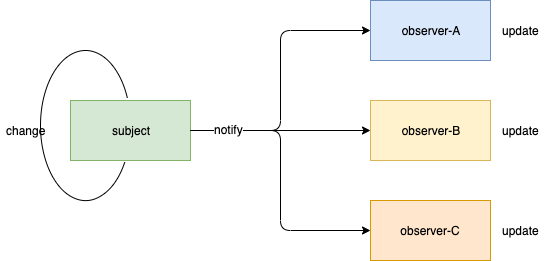

# 观察者模式

观察者模式定义对象一对多依赖关系，当一个对象发生改变时，其相关依赖对象得到通知并更新。在观察者模式中，发生改变的对象称作观察目标，其它作出反应的对象叫做观察者。
举个例子，多个摄影师围绕美女拍照，美女姿势发生变化时，摄影师为取景会出摄影姿势微调，这里美女就是观察目标，摄影师就是观察者。




## 应用场景
开发过程中，观察者模式经常被用到，最典型的例子就是事件监听。

```js
a.addEventListener('eventName', b)
a.addEventListener('eventName', c)
```

这里a是观察目标，b/c是观察者，当a更新时，通过event将消息传递给b/c，b/c作出自己的行为


## 实现
Event-Bus 就是观察者模式的一个典型例子，我们一起来实现一下：

```typescript
type Listener = (eventName: String, info: unknown) => unknown;

class EventBus {
  listenerMap: Map<string, Listener[]>;
  constructor() {
    this.listenerMap = new Map();
  }

  on(eventName: string, fn: Listener) {
    const { listenerMap } = this;
    if (!listenerMap.has(eventName)) {
      listenerMap.set(eventName, []);
    }

    listenerMap.get(eventName).push(fn);
  }

  emit(eventName: string, info?: unknown) {
    const { listenerMap } = this;
    if (!listenerMap.has(eventName)) {
      return;
    }

    const listeners = listenerMap.get(eventName);
    listeners.forEach(listener => listener(eventName, info));
  }

  off(eventName: string) {
    const { listenerMap } = this;
    if (listenerMap.has(eventName)) {
      listenerMap.delete(eventName);
    }
  }
}
```

## 参考
- [维基百科](https://zh.wikipedia.org/wiki/%E8%A7%82%E5%AF%9F%E8%80%85%E6%A8%A1%E5%BC%8F)
- [观察者模式](https://design-patterns.readthedocs.io/zh_CN/latest/behavioral_patterns/observer.html)
