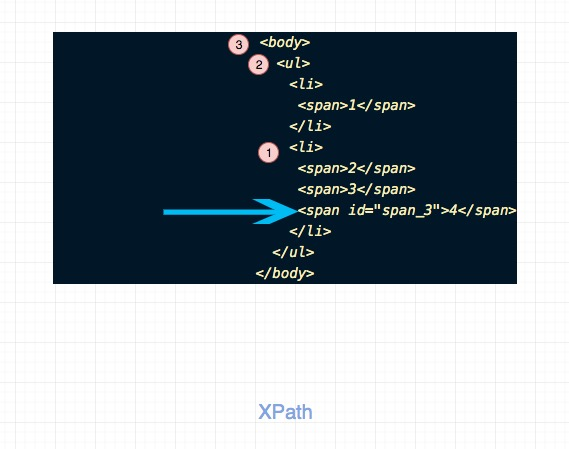

# 实现XPath

## 题目描述

实现一个函数，生成某个DOM元素的xpath，主要包含两部分：标签层级和兄弟元素中的顺序。

比如：

```
<body>
  <ul>
    <li>
      <span>1</span>
    </li>
    <li>
      <span>2</span>
      <span>3</span>
      <span id="span_3">4</span>
    </li>
  </ul>
</body>

```

如果传入id = "span_3" 的元素，那么生成的xpath是`body>ul[0]>li[1]>span[2]`

## 思路

我们的参数是目标节点，我们的目标是冒泡到body，然后记录中间的节点即可。

如图所示：



整个过程是：

- 我们通过target先找到了parentNode,即li。
- 我们通过li找到了parentNode,即ul。
- 我们通过ult找到了parentNode,即body。
- 结束


另外 DOM Node 数据结构大概是：

```js
{
  tagName: 'BODY',
  children: [
    {
      tagName: 'UL',
      children: [
        {
          tagName: 'LI',
          children: [{
            tagName: 'SPAN'
          }]
        }
      ]
    }
  ]
}

```

可以看出DOM Node是一种递归的数据结构，因此用递归来实现会非常直观和简洁。
如果不是特别严格的场景，通常也不会有严重性能问题。

## 关键点

- DFS
- 回溯
- parentNode 获取父节点， children 获取子节点

## 代码


```js

function helper(node, path) {
  if (node === document.body) return `body ${path}`;

  const i = Array.prototype.findIndex.call(node.parentNode.children, el => el === node)
  return  helper(node.parentNode, `${path} > ${node.tagName.toLowerCase()}[${i}]`);
}

function XPath(node) {
  return helper(node, '');
}


```