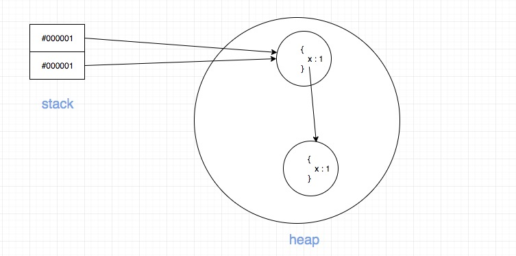
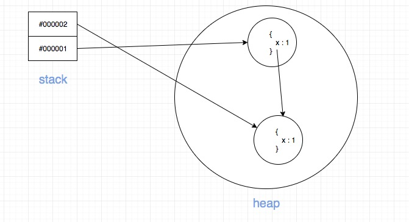

## 引用和操作符优先级

### 第一题

```js
var a = { x: 1 };
var b = a;
a = a.x = { x: 1 };
console.log(a);
console.log(b);
```

<details>
  <summary>以上代码输出什么？为什么</summary>
  答案：

- 先输出{x:1}
- 再输出{x:{x:1}}

解释：

解决这道题目的关键点有两个

1. .操作符的的运算优先级问题, .的优先级高于赋值语句
> 更多优先级可以操作[MDN](https://developer.mozilla.org/zh-CN/docs/Web/JavaScript/Reference/Operators/Operator_Precedence)
2. 能够明白浏览器的内存分配原理

为了方便理解，我画了内存图。

当执行到以下代码的时候

```js
var a = { x: 1 };
var b = a;
```

内存图如图所示：


然后，我们将下面代码拆解为:

```js
a.x = { x: 1 };
a = a.x;
```

当执行到

```js
a.x = { x: 1 };
```
的时候，内存是这样的：




最后，当执行到：

```js
a = a.x;
```
的时候，内存图如下：



如果这里看明白了，那么答案就呼之欲出了。

</details>
